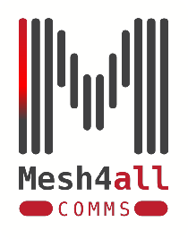
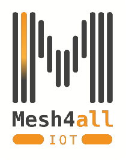
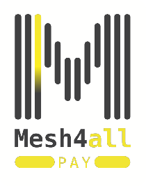
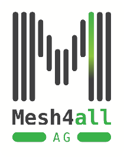
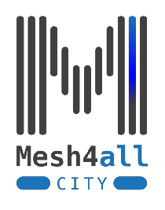
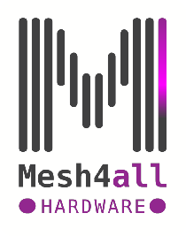

    

 

    
    

Mesh4all is dedicated to maintaining open-source software and hardware directories with appropriate documentation in multiple languages. To guarantee access to resilient, persistent mesh networks worldwide. We will also be tasked with disseminating the technology among faculty, students and businesses in developing nations where accessibility to the internet is limited and non-existent.

The mesh we are working on will be known as Mesh4(M4): join, use, speak, send, pay, mesh4all!

Our main purpose is to expand web accessibility to users worldwide via an open-source repository for Mesh software and hardware for M4, via unfettered, resilient connectivity to a open mesh through devices of all kind proprietary, open and DIY. We will contribute towards the adoption of M4 and its devices.   

Our Mission is to expand the mesh, M4,  for any and all peoples and organizations in a permissionless manner via our open source software and hardware community run repositories. We will also actively invest any proceeds into hardware research and code/functionality that run on the mesh.

Our Vision is a worldwide mesh network that can be easily accessed by anyone at very low cost or no cost at all with low energy consumption open hardware devices.
   

We Value the ability for anyone to communicate,  transact, and participate in a network without having a centralised entity acting as a gatekeeper for approval. MESH4ALL!

Take a look to all our subprojects
<table align="center">
    <tr>
        <td>
            <a href="#" align="center">
                
                
Comms

            </a>
        </td>
        <td>
            <a href="#" align="center">
                
                
IoT

            </a>
        </td>
        <td>
            <a href="#" align="center">
                
                
Pay

            </a>
        </td>
    </tr>
    <tr>
        <td>
            <a href="#" align="center">
                
                
Agriculture

            </a>
        </td>
        <td>
            <a href="#" align="center">
                
                
City

            </a>
        </td>
        <td>
            <a href="#" align="center">
                
                
Hardware

            </a>
        </td>
    </tr>
</table>

## License

 
Licensed under the Apache License, Version 2.0 (the "License"); you may not use this file except in compliance with the License.

 You may obtain a copy of the License at
 
  http://www.apache.org/licenses/LICENSE-2.0

  or in the [LICENSE](LICENSE) file, in the root folder of this repository.

Unless required by applicable law or agreed to in writing, software distributed under the License is distributed on an "AS IS" BASIS, WITHOUT WARRANTIES OR CONDITIONS OF ANY KIND, either express or implied.

See the License for the specific language governing permissions and limitations under the License.

Copyright (c) 2022 Mesh4all <mesh4all.org>

Licensed under the Apache License Version 2.0 Unless required by applicable law or agreed to in writing, software distributed under the License is distributed on an "AS IS" BASIS, WITHOUT WARRANTIES OR CONDITIONS OF ANY KIND, either express or implied. See the License for the specific language governing permissions and limitations under the License.

 

    <a href='#'>Documentation</a> |
    <a href='https://t.me/mesh4all'> Telegram </a>  |
    <a href="https://twitter.com/mesh4all"> Twitter </a>

For more information see our [official website](https://mesh4all.org), and you also could join us in the [discord]() and discuss with the development team.
